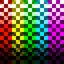

# Cub3D  

~ Started on: 13/10/2024 ~ *** ~ Ended on: IN PROGRESS

***
## Summary:
My first RayCaster with miniLibX ----------------------->  

This project is inspired by the world-famous Wolfenstein 3D game, which was the first FPS ever.  
It will enable you to explore ray-casting.  
Your goal will be to make a dynamic view inside a maze, in which you’ll have to find your way.

***
## Content of this repository:
- [The New_Libft](https://github.com/Sulig/New_Libft)
- [MinilibX Codam](https://github.com/codam-coding-college/MLX42)
  - // Clonned into repo when you "make"
- [Subject English](https://github.com/Sulig/Cub3D/blob/master/Cub3D_subject-en.pdf)

> [!WARNING]\
> This repository is just started! Don't expect to encounter so much thing right now...

***
~ Made by sadoming ~
***
